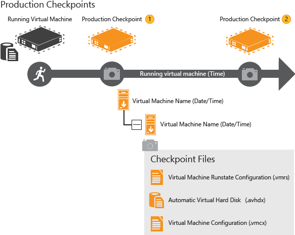

#对 Windows 10 超 V 简介

无论你是一个软件开发人员、 it 专业人员或一个科技爱好者，你们很多人需要偶尔在许多不同的机器上运行多个操作系统。
不是所有人都有一套完整的实验室，以容纳所有这些机器，访问，因此虚拟化可以节省了空间和时间。

这是一个图像:

##使用虚拟化

虚拟化使任何人都可以轻松地维护组成的许多操作系统、 软件配置和硬件配置的多个测试环境。
HYPER-V 提供虚拟化 Windows 以及一个简单的机制而不会导致额外的硬件成本这些环境之间进行快速切换。

超 V 可以使用在许多方面，例如:

*   由多个虚拟机组成的测试环境可以创建单一的台式计算机或便携式计算机上。
    完成测试后，这些虚拟机可以导出，然后导入到任何其他 HYPER-V 系统。
*   开发人员可以使用他们的计算机上的 HYPER-V，在多个操作系统上的软件进行测试。
    例如，如果你有一个应用程序必须在 Windows 8、 Windows 7 和 Linux 操作系统的系统上进行测试，可以在您的开发系统，其中每个这些操作系统上创建多个虚拟机。
*   你可以使用 HYPER-V 排查从任何 HYPER-V 部署的虚拟机。
    你可以从您的生产环境中导出虚拟机、 打开它在您的桌面上运行 HYPER-V、 执行您所需的故障排除步骤，然后将它导出到生产环境。
*   使用虚拟网络，您可以创建一个多机的测试/开发/示范是从影响生产网络安全环境。
*   爱好者可以使用它来与其他操作系统的实验。
    超-V 使得它很容易拿，拆掉不同的操作系统。
*   为展示旧版本的 Windows 或非 Windows 操作系统，可以在笔记本电脑上使用 HYPER-V。

##系统要求

HYPER-V 需要有第二个级别地址翻译 (板) 的 64 位系统。 金属板是目前在当前这一代的英特尔和 AMD 的 64 位处理器的功能。 你还需要 64 位版本的 Windows 8 或更高版本和至少 4 GB 的 RAM。 超 V 在 Vm 不支持 32 位和 64 位操作系统创建。

超 V 动态内存允许所需由 VM 分配和解除分配动态内存 (您指定的最小值和最大值) 和未使用之间共享内存的虚拟机。
您可以在具有 4 GB 的 RAM 的计算机上运行 3 或 4 的 Vm 但你需要更多的 RAM 为 5 或更多虚拟机。
在光谱的另一端，你还可以创建大 Vm 与 32 处理器和 512 GB RAM，具体取决于您的物理硬件。

##你可以在虚拟机上运行的操作系统

"客人"是指虚拟机和"主机"是指运行虚拟机的计算机。
超 V 上 Windows 支持许多不同的来宾操作系统包括 Linux、 FreeBSD 和 Windows 的各种版本。
哪些操作系统支持作为嘉宾在 HYPER-V 在 Windows 上的信息，请参阅[支持的 Windows 来宾操作系统](supported_guest_os.md)和[Linux 和 FreeBSD 虚拟机上超 V](https://technet.microsoft.com/library/dn531030.aspx).

##在 Windows 上超 V 和超 V 在 Windows 服务器上之间的区别

有一些工作以不同的方式在 HYPER-V 在 Windows 比他们做 HYPER-V 在 Windows 服务器上运行的功能。
这些包括以下内容:

*   内存管理模式是不同的 HYPER-V 在窗户上。
    在服务器上，超 V 内存管理只有虚拟机正在运行在服务器的假设。
    在 HYPER-V 在 Windows 上，了解大多数客户机是运行软件以及运行中的虚拟机管理内存。
    例如，开发人员可能运行 Visual Studio，以及几个虚拟机在同一台计算机上。
*   SR-IOV 64 位访客上正常工作，但 32 位不和不受支持。

###Windows 服务器功能不整装 Windows HYPER-V

有一些功能包括在 HYPER-V 服务器上未包含在 HYPER-V 在窗户上。
这些包括以下内容:

*   虚拟化 Gpu 远程 FX 能力
*   实时迁移的虚拟机从一台主机到另一个
*   超 V 副本
*   虚拟光纤通道
*   SR-IOV 网络
*   共享。VHDX

> **警告**: 在 HYPER-V 上运行的虚拟机不会自动处理从有线到无线连接。
> 您必须更改虚拟机的网络适配器设置手动。
> 

##限制

使用虚拟化也有局限性。
功能或应用程序依赖于特定的硬件好在 VM 将不工作。
例如，如果游戏或应用程序需要处理与 Gpu (不提供软件回退) 可能不好工作。
应用程序依赖于子 10ms年定时器，像延迟敏感高精度应用程序如现场音乐混合应用程序等可以也在虚拟机中运行的问题。
根操作系统也运行在 HYPER-V 虚拟化层，但它是特别的它具有对所有硬件的直接访问。
这就是为什么具有特殊硬件要求应用程序继续工作不受阻碍地在根操作系统但延迟敏感的、 高精度应用程序仍可能在根操作系统中运行的问题。

作为一个提醒，你需要有你在虚拟机测试中使用任何操作系统的有效许可证。

##下一步:

[演练超-V 上 Windows 10](..\quick_start\walkthrough.md)

退房[什么是新](whats_new.md)在超-Windows 10 V。

e root OS is also running on top of the Hyper-V virtualization layer, but it is special in that it has direct access to all the hardware. This is why applications with special hardware requirements continue to work unhindered in the root OS but latency-sensitive, high-precision apps could still have issues running in the root OS.

As a reminder, you'll need to have a valid license for any operating systems you use in the VMs test.

## Next step: 
[Walkthrough Hyper-V on Windows 10](..\quick_start\walkthrough.md) 

Check out [What's New](whats_new.md) in Hyper-V on Windows 10.

